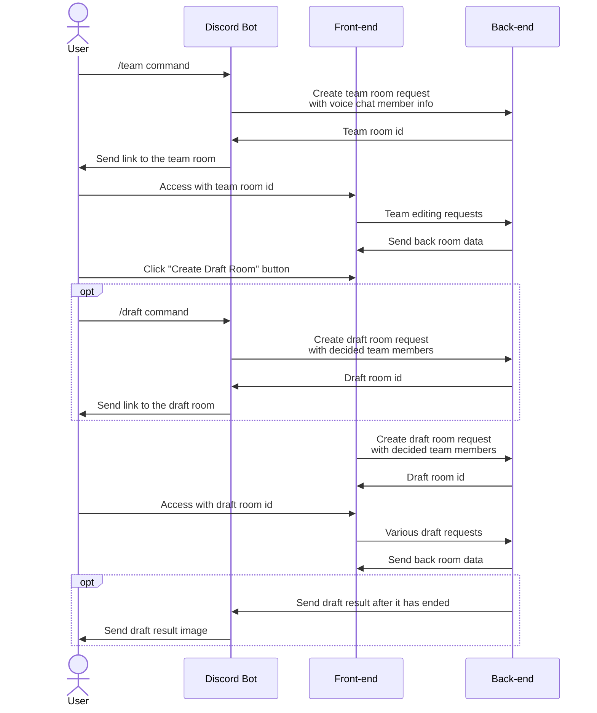

# LoL Custom Tools

This is the front-end implementation for the [LoL Custom Tools](https://lol.tunatuna.dev).

## Tech Stacks
- [Bun](https://bun.sh/) (JavaScript runtime)
- [Next.js](https://nextjs.org/) (Front-end library)
- [Kuma UI](https://www.kuma-ui.com/) (Front-end styling library)

## Features
### Team creation
- Access to the [team creation tool](https://lol.tunatuna.dev/team).
- You can use `/team` command of the discord bot to automatically import members in your voice chat into the tool.
- TODO: insert iamge here

### Draft Ban/Pick Simulator
- Access to the [draft tool](https://lol.tunatuna.dev/draft)
- You can use `/draft` command of the discord bot to create draft room and send link.
- TODO: insert some images here

## How it works
This app works with a combination of [back-end websocket server](https://github.com/tunatuna1733/lol-draft-websocket) and [discord bot](https://github.com/tunatuna1733/lol-draft-sapphire) (optional).

